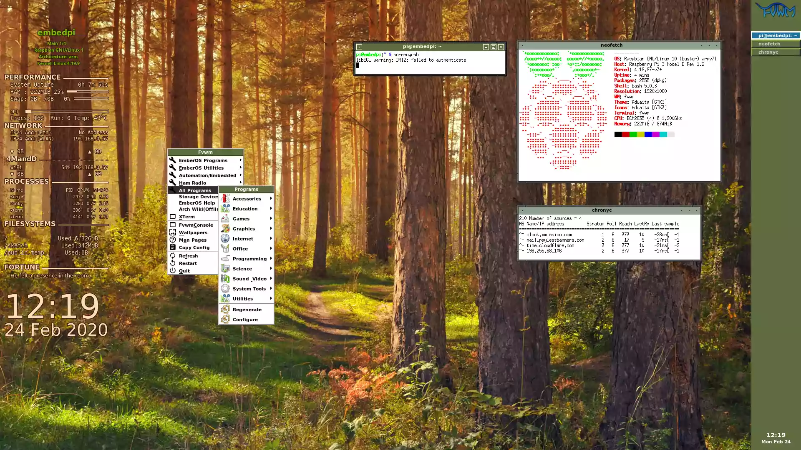

This is a customPiOs tool for setting up a pi image suitable for consumer-grade embedded use. 

It has a variety of preinstalled applications and can be configured almost entirely via a special windows-accessible /sketch partition.

Notably, everything except /sketch boots as read-only, and there is an Apache2 server and a chromium based kiosk browser enabled by default.

This is a "batteries included" distro, meant to be usable in odd places when you might not
even have internet access. As such, it includes a lot of stuff and requires a 16GB card(The image is just under 9GB min, including 1024MB of free space on root.)

It would be possible to remove some things and shrink it, but I don't suggest this, as 
a 16GB card will make wear leveling more effective and give your app room to expand.


See [Here](EmberOS/src/modules/embedpi/filesystem/sketch/share/ember-doc/) for info on how to do common stuff.

### Goals

* Reliable embedded control and digital signage
* Do almost anything offline once you have the image, most common tools included
* Usable for basic desktop tasks, if you're careful not to save stuff to volatile folders
* Declaratively configurable, you should be able to do almost everything just by editing files in /sketch
* As little configuration as possible for common tasks, everything should just work.
* Convenient platform for experimenting with your setup, includes all tools for minor tweaks to just about everything without needing a desktop computer.
* Things that require updates to keep working(Timezones, SSL, etc) are managed via /sketch for easy updates.

* Basically anything that's more of a "device" than a computer, that needs to be reliable and doesn't store too much data.



### Use Cases

* Light duty embedded control/Home Automation(Kaithem or NodeRed)
* Digital Signage
* Offline Wiki Server
* Kiosk browser
* DLNA Media server/Samba fileserver/Web server/Torrent box
* Basic Desktop computer(If you are careful about the volatile home dir) 
* Realtime audio mixing with multiple soundcards(through Kaithem)
* Background Music player(Kaithem or Audacious)
* Amateur Radio station
* Mesh Networking node


#### Semi read only
 Read only root filesystem, and mostly read only /home/pi, with carefully controlled symlinks to persistent folders to make apps work as they should, while keeping everything
 else read only, or purely volatile, so things like chromium's absurd disk writes can't cause trouble.


## Security

This is meant for easily creating embedded systems that run on *private* networks, in physically secure places(e.g. your house, where nobody
can tamper with the pi).

THE DEFAULT PASSWORD IS USED FOR KAITHEM, which runs as root. The standard pi:raspberry password is used for SSH.

Do *not* open a port to let people on the internet access this, 
without a firewall/nat/etc unless you change this, or disable password auth(Probably the better option)

There is also an unsecured Mosquitto MQTT server. Nothing is currently using it, but if you
do, be sure nobody can access those ports. 


Think of it like the common WiFi printers and file servers that allow anyone on the network to print.

Also, the included SSL keys in /sketch/kaithem/ssl, and the SSH keys, are randomly generated on boot if missing.

They are just self signed keys though, you will get a warning in your browser.


### Changing the passwords
At the moment, users and passwords are stored in their normal place.  /sketch is mostly for the things one might want under version control, to deploy repeatedly, or the stuff you might
want to chage really quickly for basic non-critical non-secure use.

I might move /etc/shadow, but for now just do `writable` then change passwords in the usual way, the users aren't exactly part of the "application data" anyway.


### /sketch

To provide some semblance of security, umask is used to keep this from being accessed by anyone but root.
It can be read and executed by root's group, but only written by root itself, aside from via BindFS.

It is not encrypted though.


## Prebuilt image

Builds are available as torrents only, and unless otherwise noted, may
go away when newer versions are released(My seedbox is fairly small!).

### Mar 4 2020 Build
```
magnet:?xt=urn:btih:UCPOQ4SCKM2NBKSFBZQOXZOBI6NX2JYZ&dn=EmberOS2020Mar4.zip&xl=3701126025&tr=udp%3A%2F%2Fexodus.desync.com%3A6969
```

### Dec 07 2019 alpha build

magnet:?xt=urn:btih:43679a8e9597c89a6f68612bb57e9169a662b44c&dn=2019Dec7EmberOS.zip&tr=udp%3a%2f%2ftracker.leechers-paradise.org%3a6969&tr=udp%3a%2f%2ftracker.coppersurfer.tk%3a6969&tr=udp%3a%2f%2fopen.demonii.com%3a1337&tr=udp%3a%2f%2ftracker.pomf.se&tr=udp%3a%2f%2fexodus.desync.com%3a6969&x.pe=97.126.96.222:44319&x.pe=[2602:61:7e60:de00:30e5:5f70:3d00:4bbd]:44319&x.pe=[fd00::95f1:a94c:35be:32ff]:44319&x.pe=[2602:61:7e60:de00:b095:fd54:f0dc:1c3c]:44319&x.pe=[fd00::b095:fd54:f0dc:1c3c]:44319&x.pe=[fd00::d83c:8af6:9c12:cdec]:44319&x.pe=[200:615:1617:bc9f:9ae8:14fe:2673:10c0]:44319&x.pe=[2602:61:7e60:de00:d83c:8af6:9c12:cdec]:44319

## Building(Need linux)

Clone this repo with all submodules

Put a fresh zipped raspbian full image in the src/images dir

Run sudo ./build_dist in the src dir. This may take over an hour, and 
you need internet access the whole time.

Cd into the src/workspace folder.
Expand the disk image by padding it with zeros:
Example:
`dd if=/dev/zero bs=1M count=1K >> 2019-06-20-raspbian-buster-full.img`
Change the filenames as neccesary. Count is in blocks. This appends about 1GB of extra space. You probably don't need this much.

You can also just shrink / to make room for the sketch partition.  You may want to keep it small for 8GB sd cards


Mount the partition using `sudo udisksctl loop-setup -f 2019-06-20-raspbian-buster-full.img` 

Using your favorite partition editor, add an ntfs partition called sketch just after the root partition, in that empty space you just made.

Copy everything in the root partition's sketch dir to the root of that partition.  Anything in the actual sketch dir is just the default, it gets covered over by the sketch partition that gets mounted there

Using rsync, copy the latest Included Data torrent's sketch folder over to the sketch partition(It has things like a few sample image files and the offline docs):

```
magnet:?xt=urn:btih:c8fde4b8305851937bbb9e19d625ca1b8e3290d1&dn=sketch_included_data.zip&tr=udp%3A%2F%2Fexodus.desync.com%3A6969
```

Should some unknown bug happen and /usr/share/mime has very few files in it, you will have
to manually fix this, probably by copying the files there from a debian host machine or something.

If your image is for systems with an RTC, see "using an RTC"

### The Bindings Manager

More documentation to come, but basically, everything is managed via
a "bind engine" that takes config files and uses them to set up bindings
between /sketch and other places.

BindFS allows permission-transformed views, which is how other users can write to selected dirs in /sketch, which is normally owned by root with mode 700.

The binding manager runs once at boot.

This is what config files look like:

```yaml
cat << EOF > /sketch/config/filesystem/some_directory.yaml
/sketch/foo:
    #Mode must be quoted
    mode: '0755'
    #/var/lib/someApplication and all files under
    #it appear to be owned by root
    user: root
    #Binds /sketch/home/foo to /var/lib/someApplication
    bindat: /var/lib/someApplication
    pre_cmd: echo beforemainbindmount
    post_cmd: echo aftermainbindmount
    #This binds /var/lib/someApplication/foo to /etc/foo
    bindfiles:
        foo: /etc/foo
```
This is managed by `fs_bindings.service`

### Apps
[See Here](docs/IncludedApps.md)


## Using an RTC
Add one of these lines to /boot/config.txt
```
dtoverlay=i2c-rtc,ds1307
dtoverlay=i2c-rtc,pcf8523
dtoverlay=i2c-rtc,ds3231
```
