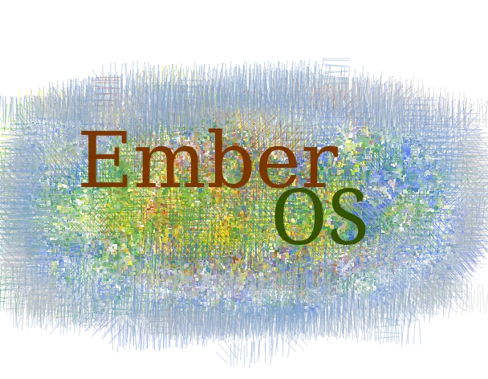

This is a customPiOs tool for setting up a pi image suitable for consumer-grade embedded use. 

It has a variety of preinstalled applications and can be configured almost entirely via a special windows-accessible /sketch partition.

Notably, everything except /sketch boots as read-only, and there is an Apache2 server and a chromium based kiosk browser enabled by default.

This is a "batteries included" distro, meant to be usable in odd places when you might not
even have internet access. As such, it includes a lot of stuff and requires a 16GB card(The image is just under 9GB min, including 1024MB of free space on root.)

It would be possible to remove some things and shrink it, but I don't suggest this, as 
a 16GB card will make wear leveling more effective and give your app room to expand.


### Goals

* Reliable embedded control and digital signage
* Do almost anything offline once you have the image, most common tools included
* Usable for basic desktop tasks, if you're careful not to save stuff to volatile folders
* Declaratively configurable, you should be able to do almost everything just by editing files in /sketch
* As little configuration as possible for common tasks, everything should just work.
* Convenient platform for experimenting with your setup, includes all tools for minor tweaks to just about everything without needing a desktop computer.
* Things that require updates to keep working(Timezones, SSL, etc) are managed via /sketch for easy updates.

* Basically anything that's more of a "device" than a computer, that needs to be reliable and doesn't store too much data.


### Use Cases

* Light duty embedded control/Home Automation(Kaithem or NodeRed)
* Digital Signage
* Offline Wiki Server
* Kiosk browser
* DLNA Media server/Samba fileserver/Web server/Torrent box
* Basic Desktop computer(If you are careful about the volatile home dir) 
* Realtime audio mixing with multiple soundcards(through Kaithem)
* Background Music player(Kaithem or Audacious)
* Amateur Radio station
* Mesh Networking node


#### Semi read only
 Read only root filesystem, and mostly read only /home/pi, with carefully controlled symlinks to persistent folders to make apps work as they should, while keeping everything
 else read only, or purely volatile, so things like chromium's absurd disk writes can't cause trouble.

 
## Enabling services

Instead of SSHing in(Which may not always be available), you can activate any systemd
service by editing the config files(See /sketch/config/autostart/).

They are very simple INI files.

You can't disable services enabled via systemctl this way(Under the hood, a script reads the file and starts all enabled services but does not sto anything).  The intent is to use the config files for all optional or user services.


## Security

This is meant for easily creating embedded systems that run on *private* networks, in physically secure places(e.g. your house, where nobody
can tamper with the pi).

THE DEFAULT PASSWORD IS USED FOR KAITHEM, which runs as root. The standard pi:raspberry password is used for SSH.

Do *not* open a port to let people on the internet access this, 
without a firewall/nat/etc unless you change this, or disable password auth(Probably the better option)

There is also an unsecured Mosquitto MQTT server. Nothing is currently using it, but if you
do, be sure nobody can access those ports. 


Think of it like the common WiFi printers and file servers that allow anyone on the network to print.

Also, the included SSL keys in /sketch/kaithem/ssl, and the SSH keys, are randomly generated on boot if missing.

They are just self signed keys though, you will get a warning in your browser.


### Changing the passwords
At the moment, users and passwords are stored in their normal place.  /sketch is mostly for the things one might want under version control, to deploy repeatedly, or the stuff you might
want to chage really quickly for basic non-critical non-secure use.

I might move /etc/shadow, but for now just do `writable` then change passwords in the usual way, the users aren't exactly part of the "application data" anyway.


### /sketch

To provide some semblance of security, umask is used to keep this from being accessed by anyone but root.
It can be read and executed by root's group, but only written by root itself, aside from via BindFS.

It is not encrypted though.


## Prebuilt image

Builds are available as torrents only, and unless otherwise noted, may
go away when newer versions are released(My seedbox is fairly small!).

### Dec 07 2019 alpha build

magnet:?xt=urn:btih:43679a8e9597c89a6f68612bb57e9169a662b44c&dn=2019Dec7EmberOS.zip&tr=udp%3a%2f%2ftracker.leechers-paradise.org%3a6969&tr=udp%3a%2f%2ftracker.coppersurfer.tk%3a6969&tr=udp%3a%2f%2fopen.demonii.com%3a1337&tr=udp%3a%2f%2ftracker.pomf.se&tr=udp%3a%2f%2fexodus.desync.com%3a6969&x.pe=97.126.96.222:44319&x.pe=[2602:61:7e60:de00:30e5:5f70:3d00:4bbd]:44319&x.pe=[fd00::95f1:a94c:35be:32ff]:44319&x.pe=[2602:61:7e60:de00:b095:fd54:f0dc:1c3c]:44319&x.pe=[fd00::b095:fd54:f0dc:1c3c]:44319&x.pe=[fd00::d83c:8af6:9c12:cdec]:44319&x.pe=[200:615:1617:bc9f:9ae8:14fe:2673:10c0]:44319&x.pe=[2602:61:7e60:de00:d83c:8af6:9c12:cdec]:44319

## Building(Need linux)

Clone this repo with all submodules

Put a fresh zipped raspbian full image in the src/images dir

Run sudo ./build_dist in the src dir. This may take about an hour, and 
you need internet access the whole time. It is not fully scripted, at one point samba will ask to modify the config file. You should say yes. Say no when wireshark asks about non superusers sniffing traffic.


Cd into the src/workspace folder.
Expand the disk image by padding it with zeros:
Example:
`dd if=/dev/zero bs=1M count=1K >> 2019-06-20-raspbian-buster-full.img`
Change the filenames as neccesary. Count is in blocks. This appends about 1GB of extra space. You probably don't need this much.

You can also just shrink / to make room for the sketch partition.  You may want to keep it small for 8GB sd cards


Mount the partition using `sudo udisksctl loop-setup -f 2019-06-20-raspbian-buster-full.img` 

Using your favorite partition editor, add an ntfs partition called sketch just after the root partition, in that empty space you just made.

Copy everything in the root partition's sketch dir to the root of that partition.  Anything
in the actual sketch dir is just the default, it gets covered over by the sketch partition that gets mounted there.

Copy an Arch linux Zim wiki file to <sketchpartition>/share/wikis/archlinux
Do not copy it to the sketch folder on the root partition, that would be wasteful.

Should some unknown bug happen and /usr/share/mime has very few files in it, you will have
to manually fix this, probably by copying the files there from a debian host machine or something.

If your image is for systems with an RTC, see "using an RTC"

## Using an RTC
Add one of these lines to /boot/config.txt
```
dtoverlay=i2c-rtc,ds1307
dtoverlay=i2c-rtc,pcf8523
dtoverlay=i2c-rtc,ds3231
```

## Getting online
Look in /sketch/networks, edit the wifi file as appropriate, or just connect ethernet.

These are NetworkManager files, so wifi will automatically reconnect for you, and you can configure almost any kind of network you want.

You can also go to the command line and use "nm-tui" to connect.


## Sharing Files

Samba is enabled by default and exposes three shares. You can change any of this in
/sketch/config/smb.conf, which is just a standard samba config file.

### temp

This is readable and writable by anyone, however, it is a very small TMPFS, only useful
for quick and dirty sharing of non-private stuff under 32MB.  It is backed by the folder 
/public.temp, also readable by anyone.


### media

Used for media sharing, not writable from the network. Backed by /sketch/public.media(Bound to /var/public/media, which is readable by all and only writable by root).

There is a special subfolder called pi, which is bound to /home/pi/public.media, owned by pi, and readable to any.

### media

Used for general sharing, not writable from the network. Backed by /sketch/public.files(Bound to /var/public/files, which is readable by all and only writable by root).

There is a special subfolder called pi, which is bound to /home/pi/public.files, owned by pi, and readable to any.


## Securing SSH

In /sketch/ssh/pi, you will find everything you might expect to see in ~/.ssh

You can add authorized keys there, same as you would in .ssh on any machine!

/sketch/ssh/ssh_config is equivalent to /etc/ssh_config.

Use this to disable password auth:
`PasswordAuthentication no`

There is no way to change the password for pi via the sketch folder,
however by disabling password auth, you can prevent anyone without physical access
from getting the chance to even try the password.

If you want to allow root login(May be needed for SFTP clients), use:
`PermitRootLogin yes`

And add the keys to /sketch/ssh/root/


## Changing the Kiosk UI

Everything is defines in /sketch/kioskUI.conf, a standard FVWM config file that launches fullscreen chrome by default, but can be customized
to do just about anything.

Look at the very bottom for the lines that deal with launching apps.

## Changing the timezone
/sketch/timezone is a text file that should just contain an Olson timezone name like "Us/Pacific" without quotes.

## Running a script without SSH

At boot, if there is a file named `/sketch/provisioning.sh`, it will be ran, then renamed to `/sketch/provisioning.sh.RAN`, and any output logged
to `/sketch/provisioning.sh.log`


## Using

Change /sketch/hostname to the name you want to give it.  You can now access
it as hostname.local

If you need to "factory reset" an image, just delete and copy from rootfs /sketch to the sketch partition. 

If you need to update or install new software to the system itself, just SSH in and use
`sudo mount -o remount,rw /` to remount the root as writable, do your work, and reboot.

Note that this won't affect home dirs, they have a separate tmpfs.


### Kaithem

Go to https://hostname.local:8001, and ignore the security warnings you will get(You're on a private network, right?)

You can now use it as any other Kaithem instance.  Look at the example module to get started.
Anything you create gets saved back to that /sketch partition.


### The Home Dir and normal desktop use

/home/pi is in a tmpfs, but /home/pi/persist is bound to /sketch/home/pi, and anything in there is persistant.

The contents of /home/pi/persist/.home_template are copied to /home/pi after the tmpfs is mounted.

By default, many common folders that seem logical to assume you want persistant storage for are symlinked to the persist folder. ALWAYS CHECK BEFORE PUTTING IMPORTANT DATA SOMEWHERE!

DO NOT PUT ANYTHING YOU WANT TO KEEP IN THE ROOT OF THE HOME DIR!!!


#### Adding a persisant directory/customizing the home dir
```
#Create the actual persistant directory
mkdir persist/foo

#Now create a link to it. You can't just put it in the home dir directly,
#As that is just a tmpfs

#So you add it to the .home_template, which is copied to home on boot.
ln -s persist/foo .home_template/foo
```

#### Other user's home dirs

Other users home dirs won't be set up like this unless you do it manually, EmberOS is mostly assuming  with Pi as the only non-system user.


### Firewalling

EmberOS uses firewalld.  

#### The Public Zone(Dofferent than the defaults!)
The ranges used by Yggdrasil and CJDNS are mapped to the public zone which blocks almost everything incoming, including SSH(Some other setups default to allowing SSH, we don't, because raspbian has a default password).

 Everything else is trusted by default.

#### Opening a port:
 firewall-cmd --permanent --zone=public --add-port=80/tcp

### Offline Wiki Content
Put any .zim files in a subfolder of /sketch/share/wikis/(One per subfolder).

You can then activate wikioffline@SUBFOLDER:PORT.service to serve that wiki on all IPv4 addresses.

The arch linux wiki will be included in the folder archlinux, so as to facilitate debugging 
when there is no internet connection.

This is provided by a small wrapper around ZIMPly.

You can also temporarily start the wiki server with `wikioffline SUBFOLDER PORT`

### Mesh Networks
In `/sketch/config/autostart/`, enable yggdrasil.service.

To configure it, see `/sketch/config.private/yggdrasil.conf`, which is mapped to the usual
`/etc/yggdrasil.conf` file. A sane default is provided with a generated unique private key.

You may then want to set up a NetworkManager file to use ad-hoc networking. Be sure to
set the firewalld zone to `public`, or else  ensure that you are not running anything private(Like ssh with weak passwords!!!)


### Configuring Audio

If you need to force HDMI or Analog output, or change the ALSA volume of the onboard card,
just edit /sketch/config/sound.ini, and change the output option to "hdmi" or "analog" as desired.

We default to "auto", which is probably not what you want if using an HDMI monitor and 3.5mm speakers.

This is provided by `ember-manage-audio.service`


### The Bindings Manager

More documentation to come, but basically, everything is managed via
a "bind engine" that takes config files and uses them to set up bindings
between /sketch and other places.

BindFS allows permission-transformed views, which is how other users can write to selected dirs in /sketch, which is normally owned by root with mode 700.

The binding manager runs once at boot.

This is what config files look like:

```yaml
cat << EOF > /sketch/config/filesystem/some_directory.yaml
/sketch/foo:
    #Mode must be quoted
    mode: '0755'
    #/var/lib/someApplication and all files under
    #it appear to be owned by root
    user: root
    #Binds /sketch/home/foo to /var/lib/someApplication
    bindat: /var/lib/someApplication
    pre_cmd: echo beforemainbindmount
    post_cmd: echo aftermainbindmount
    #This binds /var/lib/someApplication/foo to /etc/foo
    bindfiles:
        foo: /etc/foo
```
This is managed by `fs_bindings.service`

### Apps
(See apps listing)[docs/IncludedApps.md]

## Serving Media

One of the most common tasks for embedded devices is as a media server.
Put whatever you want to serve in /sketch/public.media for DLNA.

Put whatever you want to serve as a standard web site in /sketch/public.www to serve
it on port 80 with apache. Whatever you put as index.http will be the start page for the fullscren kiosk!

Don't use the prefix "public." for anything you don't want to be made public, in case more
services are added!

This is provided by `minidlna.service` and can be disabled in the sketch autostart config.

## Adding programs to the sketch

The goal here is to be mostly batteries included, with a clean separation between your actual
application and the base image+packages, and usually you would just use "writable"
and then apt-get as normal if you need to install something.

However, /sketch/opt is bound to /sketch.opt, and /sketch/bin is bound to /usr/sketch.bin.

Both mapped views are mode 755 and root-owned.

Should you need something added to your path, and want to include it in the sketch, it is possible.


## Downloading/watching videos

Youtube-dl cannot be included, as APIs change so frequently that it would not do anyone any good.  However, you can use "sudo get-youtube-dl" to automatically get the latest version.

It will be stored in /sketch/bin, due ti the need for frequent easy updates(We consider it more like dynamic data than a real program, because of how often it updates).


## Making it actually read only

You just add ro to the fstab entry for /sketch, that's the only writable part. You won't be
able to save without SSHing(Or using kaithem's terminal) and running `sudo mount -o remount,rw /sketch`.

NTFS is a journaling filesystem, so you may or may not actually need true read only. Some stuff may break if you do this.

Almost nothing ever writes to sketch randomly by itself, so it sould not cause disk wear.

## Updating Kaithem
The whole install as found in the repo is in /sketch/opt/kaithem.  Just
copy the entire contents of the repo there.

